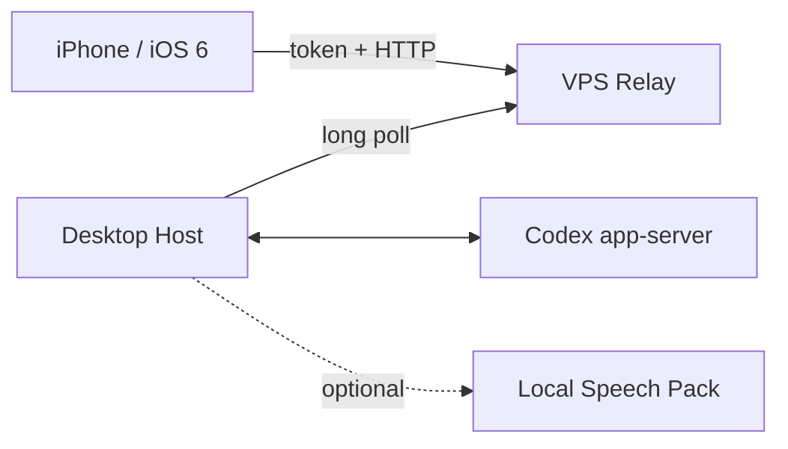

# VibeSlopik

Remote Codex control for jailbroken iPhones running iOS 6. The iPhone is a
lightweight control surface; Codex, project files, authentication and optional
speech recognition remain on your computer.

[Русская версия](README_RU.md)

## What is included

- **VPS Relay:** a small Go service that forwards authenticated requests in
  memory. It does not store chats, commands, audio or images.
- **Desktop Host:** a bilingual console application for Windows, macOS and
  Linux. It talks to the locally installed Codex app-server.
- **iOS client:** a native Objective-C armv7 application designed for iOS 6 and
  iPhone 4s. It supports projects, chats, turns, models, reasoning levels,
  approvals, limits, voice input, drafts and images.
- **Speech Pack:** an optional, explicit download. It runs faster-whisper on
  the computer and is not included in the core Host.



## Requirements

- A jailbroken armv7 device with iOS 6 and AppSync for the IPA.
- A computer with a current, authenticated Codex installation.
- A VPS running Ubuntu 22.04/24.04 or Debian 12/13, amd64 or arm64.
- About 20 MiB RAM for Relay. Host resource use depends mostly on Codex.
- Speech is optional; see [Speech Pack](docs/SPEECH.md).

## Installation

1. Install Relay on the VPS using [the VPS guide](docs/VPS.md).
2. Download the Host archive for your operating system from the latest release,
   unpack it and run `VibeSlopik-Host`.
3. Choose a language and follow the first-run menu. Enter the Relay URL, Host
   ID, Host secret and Relay admin key shown by the VPS installer.
4. Install `VibeSlopik.ipa`, then enter the iPhone URL and token printed by Host.

The firewall is never modified automatically. Relay uses plain HTTP by default;
use a trusted VPN between the devices or configure TLS externally. Read
[Security and privacy](docs/SECURITY.md) before exposing the port publicly.

## Documentation

- [VPS Relay installation and management](docs/VPS.md)
- [Desktop Host](docs/HOST.md)
- [Speech Pack](docs/SPEECH.md)
- [iOS installation and use](docs/IOS.md)
- [Architecture and protocol](docs/ARCHITECTURE.md)
- [Troubleshooting and compatibility modes](docs/TROUBLESHOOTING.md)
- [Security and privacy](docs/SECURITY.md)
- [Build from source](docs/BUILDING.md)
- [Known limitations](docs/LIMITATIONS.md)
- [FAQ](docs/FAQ.md)
- [Glossary](docs/GLOSSARY.md)
- [Updating](docs/UPDATING.md)

## Development checks

```powershell
$env:PYTHONPATH = "$PWD\src"
python -m unittest discover -s tests -v
python scripts/test-python-host.py
python scripts/test-python-relay.py
python scripts/test-ios-package.py
python scripts/test-ios-source.py
python scripts/test-release-assets.py
python scripts/audit-public-tree.py --tracked
go -C relay-go test -race ./...
```

The public release contains checksums for every downloadable artifact. Source
code is licensed under MIT. Codex and the iOS SDK are not distributed here.
