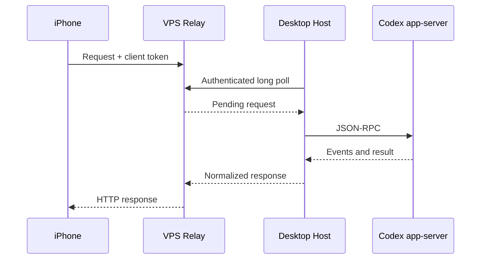

# Architecture

VibeSlopik consists of three independent components. The iPhone sends an
authenticated HTTP request to Relay. Relay holds it only in memory until the
Desktop Host polls it. Host forwards the operation to the local Codex
`app-server` and returns the normalized response through Relay.

Relay stores only registered Host credentials in its protected state file. It
does not persist requests, chats, images or audio. Host binds only to localhost;
temporary attachments and speech files are bounded and removed by cache cleanup.
The iOS client performs no background polling and keeps only bounded drafts and
media cache.

See [protocol.md](protocol.md) for endpoints and [SECURITY.md](SECURITY.md) for
the trust model.
